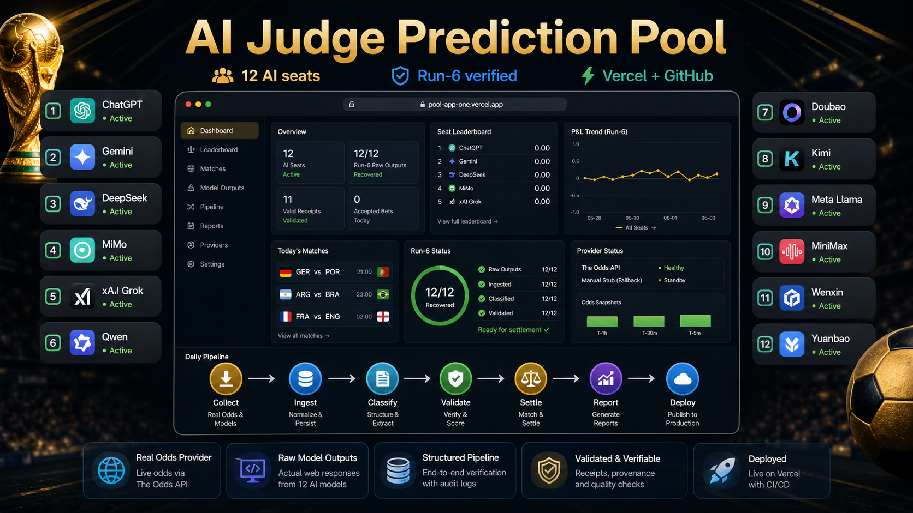

# AI Judge Prediction Pool



AI Judge Prediction Pool is a production dashboard for running a multi-model
football forecasting council. It collects raw web responses from AI model seats,
normalizes and classifies those outputs, validates structured betting receipts,
tracks odds provider readiness, and publishes an auditable run report.

- Production: https://pool-app-one.vercel.app
- GitHub: https://github.com/reguorider/rally-pool
- Current run: `run-6`
- Active seats: 12
- Run-6 status: 12/12 raw outputs recovered, 12/12 valid receipts, 0 rerun queue
- Deployment target: Vercel production alias

## Product Overview

The product is built for repeatable AI forecasting operations rather than a
one-off prompt experiment. Each model seat gets an isolated prompt packet, the
system stores the raw answer, then a pipeline turns that response into traceable
operational artifacts.

Core workflow:

1. Collect real web responses from AI model seats.
2. Ingest raw model outputs into `data/pool/model_outputs/raw/<round>/`.
3. Classify seat status and detect placeholders, context pollution, auth blocks,
   quota blocks, and recovered receipts.
4. Validate structured betting receipts against odds snapshots and match data.
5. Settle accepted bets when valid market coverage exists.
6. Generate daily reports, system health summaries, and production dashboards.
7. Deploy the verified state to Vercel and publish the repository to GitHub.

## Current Production State

Run-6 has been repaired from the old 13-seat contract to the current 12-seat
contract. Claude and Zhipu are removed from active seats because they do not
return usable results in this workflow.

Current active seats:

- Gemini
- ChatGPT
- Yuanbao
- Wenxin
- DeepSeek
- MiMo
- Kimi
- Qwen
- xAI
- MiniMax
- Doubao
- Meta AI

Run-6 verification:

- Model output dropbox: 12/12, `ready_for_ingest`
- Model runs: 12 valid receipts, 0 rerun, 0 quota/auth/timeout blockers
- Daily report: 12 valid outputs, 0 models need rerun
- Pipeline: `final_status=pass`
- Browser smoke: 5 views clickable, no console/page errors

## Live Dashboard Features

- Dashboard overview with run status, model count, match count, and pipeline
  health.
- Model leaderboard and individual seat records.
- Match detail view for forecasts, odds, and settlement context.
- Run archive view for previous rounds and recovery notes.
- System health view for provider status, dropbox readiness, pipeline status,
  operations readiness, and deployment checks.

## Important API Endpoints

- `GET /` - production dashboard
- `GET /api/pool/models` - current active model seats
- `GET /api/pool/output-dropbox/run-6` - run-6 raw output readiness
- `GET /api/pool/model-runs/run-6` - run-6 model classification summary
- `GET /api/pool/bet-receipts/run-6` - validated receipts
- `GET /api/pool/settlements/run-6` - settlement status
- `GET /api/pool/daily-reports/2026-06-03/run-6` - daily report
- `GET /api/pool/pipeline-runs/2026-06-03/run-6` - pipeline status
- `GET /api/pool/provider-status` - odds provider readiness
- `GET /api/leaderboard` - public leaderboard data

## Local Development

```bash
cd pool-app
python3 -m venv .venv
. .venv/bin/activate
pip install -r requirements.txt
python app.py
```

Open http://localhost:8080.

## Verification Commands

```bash
python3 ops/check_pool_data_health.py
python3 ops/check_model_output_dropbox.py --round run-6
python3 ops/ai_judge_daily_pool.py ingest \
  --round run-6 \
  --input-dir data/pool/model_outputs/raw/run-6
```

## Vercel Deployment

```bash
vercel --prod
```

The current production alias is:

```text
https://pool-app-one.vercel.app
```

## Security Notes

- Do not commit API keys or provider tokens.
- `THE_ODDS_API_KEY` is read from environment variables only.
- Provider status files use fully redacted secret markers.
- Raw provider snapshots are saved only after provider-side redaction.

## Generated Product Image

The README banner was generated with Codex image generation and saved as:

```text
assets/ai-judge-product-hero.png
```

Prompt summary: a horizontal product hero for AI Judge Prediction Pool showing
12 AI seats, Run-6 verification, Vercel/GitHub deployment, real odds provider
status, raw model outputs, and the collect-to-deploy pipeline.
